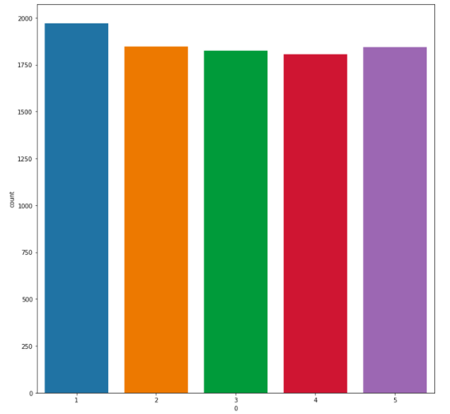
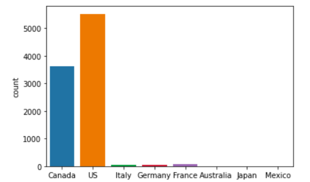
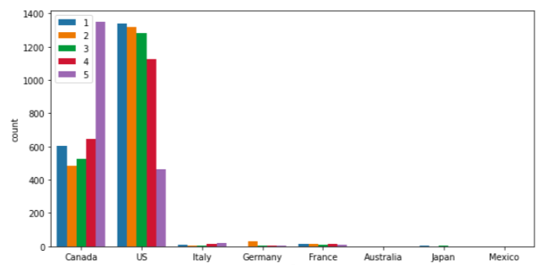
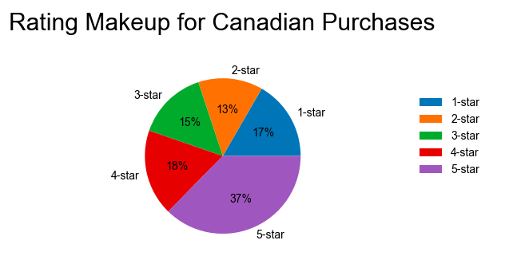
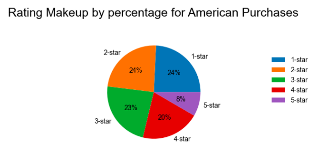
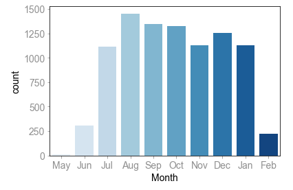
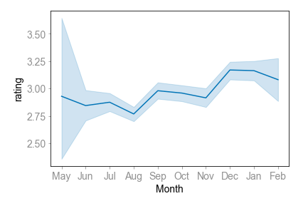
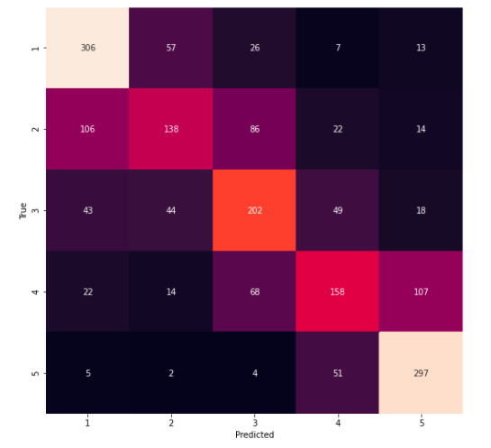

# Amazon Face Mask Rating Prediction with Neural Network Model

For a demo of the model in action: [link]

This app is built with Streamlit, and deployed on Heroku. You can write a review and/or review title, and it will return a prediction rating between 1 and 5. Longer reviews will yield better results.

## Business Case

While researchers continue to learn more about the coronavirus that causes COVID-19, experts believe that wearing a face mask is one of the most effective ways to prevent the spread of the virus. Many places have mandated mask-wearing in public places, along with other safety measures such as social distancing and hand sanitizing.

Worldwide Face Mask Industry Revenue is Expected to Grow US$ 7.24 Billion in 2020 from US$ 2.86 Billion In 2019. Currently, China is the world’s largest producer and exporter of masks. Other hygienic health products also saw a marked increase during this time.

The pandemic not only changed what people buy, it also greatly impacted how people made their purchases. According to KPMG, two-thirds of Canadians increasing their online shopping habits during COVID-19. The primary decision-making factor among Canadian shoppers is their personal and family health and safety.

Amazon has played a central during the coronavirus crisis, delivering goods to people stranded at home by government shelter-in-place orders. The surge in online buying taxed Amazon’s fulfillment centers, which saw unprecedented volumes as homebound customers flooded it with online shopping orders. 

When purchasing online, reviews and ratings from other customers impact purchasing decisions for over 93% of consumers, according to one report. 

With the rise of COVID-19, online retailers saw an unprecedented demand for face masks. Analyzing the reviews and ratings of the many types of face masks product could serve two important business goals. 

First, understanding consumer behavior could lead to better product development. For example, analyzing what differentiates a good face mask from a bad one and what sentiments get a five-star vs one-star rating could lead to better sales and happier customers.

Second, sentiment analysis could be used to recommend specific products based on customer preferences. For example, if a customer complains about 'size', 'fit', or 'large', a different size product could be suggested to the customer. Similarly, if a customer writes about 'breath', 'air', and 'fog', a product with different material could be recommended instead. As we will see later, these keywords do show up in our sample, and they consistently impact the rating and customer satisfaction.

## Machine Learning Application

I created a Neural Network (NN) model that will predict the star rating on a scale of 1 to 5, based on a written review. The training data is scrape from Amazon's product review section, using a selection of different types of face mask products.

## Packages and Libraries required
### Webscraping:
- selenium

### Data Analysis:
- numpy
- pandas
- seaborn
- matplotlib
- wordcloud

### Language Package:
- NLTK

### Modeling:
- scikit learn
- keras
- tensorflow

## Notebooks

1. Data Collection
2. Data Cleaning
3. Exploratory Data Analysis
4. Neural Network Modeling & Evaluation

## Summary

### Data Collection Goal

The goal is to first collect around 1,000 reviews for each rating from 1-star to 5-star. A preliminary search was conducted on Amazon's website for 'masks' and related keywords such as 'covid', 'N95', 'medical', and 'reusable'.

While there are many pages of products available in the search result, only a handful had a reasonable number of reviews (m>500). Some products were duplicates in the search results, so a manual inspection is required.

The following products were selected to be sampled based on the number of reviews available. Variation of mask characteristics and features was also taken into account.

| PRODUCT ID | PRODUCT NAME |
| :---------- | :------------ |
| B088825ZVV | Weddingstar 3-Ply Adult Washable Cloth Face Mask Reusable and Adjustable with Filter Pocket|
| B08DPTLW6G | Black-Face-Mask-Pack-Comfortable|
| B088K9GDN5 | THINKA-PROCEDURE-MASK-EARLOOPS-50pcs|
| B0891VVHN1 | Case-Mate-Washable-Reusable-Cotton-Filter|
| B088C2WD5F | EnerPlex-Premium-3-Ply-Reusable-Face|
| B08HWVSSPZ | Designer-Female-Fashion-Cotton-Fabric |
| B08B9BQNSY | Levis-Re-Usable-Reversible-Bandana-Caviar |
| B08P56BK1J | Under-Armour-unisex-adult-Sports-Mask |
| B086R5TCNK | Windproof-Dustproof-Breathable-Reusable-Outdoor |
| B088JY3QQD | EnerPlex-Premium-Kids-3-Ply-Reusable |
| B088YV7VCF | Gildan-Reusable-Everyday-2-Layer-Cotton |
| B08793KQ18 | TRAVLEISURE-ADJUSTABLE-REUSABLE-WASHABLE-FACE |
| B07Y2XFQMM | FCY-Balaclava-Winter-Fleece-Windproof |
| B088CV63D6 | EnerPlex-Premium-3-Ply-Reusable-Face |
| B0884VL4ZR | Perry-Ellis-Reusable-Rounded-Assorted |
| B088YS4738 | Fashion-Protective-Washable-Reusable-Elastic |
| B084TJDDL1 | AstroAI-Reusable-Dust-Face-Filters |

### Features

The features necessary for sentiment analysis are:
1. rating (ordinal, from 1 to 5)
2. title (string)
3. review (string)

Date and location were features readily available. They were scraped for EDA (exploratory data analysis).

### Webscraping with Selenium and Chrome Webdriver

Selenium WebDriver is a collection of open-source APIs used to automate the testing of a web application. This tool was selected over other methods for its ease of use. I have tried using scrappy spider in the past, and found through experience that Amazon does not like to be scraped. It will detect bots and block the IP. While a VPN could be used, it unnecessarily complicates the data collection process.

The review section for each product consists of ten reviews per page. Each review consists of a star rating, a review title, a review text, a location, and the date of the review.

Chrome webdriver was used for automation of scraping in conjunction with manual product selection.  The entire process took around 3.5 hours to complete, including manually selecting products.

The webscraping was performed on February 8th, 2021. Products and reviews may change.

1. For each page, identify the 10 reviews. 
2. Scrape the title, date, location, review, and rating. 
3. Save in CSV file as 'review_raw.csv'. 
4. Find the button for the next page.
5. Wait for 3 seconds for the page to load.
6. Repeat the process until the 'next page' button is no longer available.

### Oversampling to Balance the Data

After collecting around 3,000 reviews, a value count of frequency by rating showed that the data is highly unbalanced, with a tendency to skew towards higher ratings. There are 1,773 five-star reviews, which made up 57% of all reviews. This is unsurprising since a positive review will attract more customers, who will leave more reviews.  And only products with abundant reviews were sampled.

After around 3,000 reviews were collected, oversampling for star ratings below 5 is necessary to even out the sample. The least frequent star rating was 2. Many products were sampled solely to collect more 2-star ratings. 

On average 1860 samples were collected for each rating.

###  Cleaning the Data

Some mistakes were made during the scraping process due to the variation in data format. Some were caught early and fixed for subsequent scraping tasks.

The two types of mistakes are:
1. Country 
2. Date

The country column was expected to be a single word. However, United States was 'the United States'. I changed the data so that 'the' became 'US' in the country column.

The date value is in a human-readable format. For example, May 23, 2020 was used instead of 05-23-2020. This is fixed with pandas' to_datetime function.

Since 'country' and 'date' were scraped from the same sentence, samples that had 'the United States' also had two extra characters attached to the date, which threw an error when using the to_datetime function. The data was split, sliced, and rejoined together before the to_datetime function.

### Missing Values

First, I checked the number of null values in each column. There are only a handful of NaN values (10 ) in the review title and review text columns. Rating, location, and date do not contain null values, as expected since a rating is required and location and time are stamped automatically.

The simplest way was to remove them altogether, but I noticed some columns contained valid reviews. Therefore, I removed only the rows with both empty review titles and review texts (i.e. only a star rating is given). There is one sample where the customer wrote 'n/a' in the review text and I removed that as well. For the rest, I replaced NaN with an empty string.

### Exploratory Data Analysis (EDA)

Most of the data came from Canadian and American customers.

Canadians live up to their 'nice-guy' stereotype. They tend to give 5-star ratings approximately twice as much as other ratings. Americans, on the other hand, tend to give 5-star ratings less than half as frequently as other ratings.

### Rating and Review Count Over Time

Of all the reviews I have scraped from Amazon, the number of reviews is consistent between the month of July 2020 and January 2021. This is loosely correlated with covid case numbers and public endorsement of masks.

### Modeling with Neural Network

There are many effective ways to make classification predictions, and a neural network was chosen for this task. 

Artificial Neural Networks and Deep Neural Networks are effective for high dimensionality problems, but they are also theoretically complex. Fortunately, there are deep learning frameworks, like TensorFlow, to simplify and streamline the process.

### One-Hot-Encoding

Many machine learning algorithms cannot work with categorical data directly. The categories must be converted into numbers. One hot encoding (or dummy encoding) allows the representation of categorical data by a process of “binarization” of the category and includes it as a feature to train the model. In this case, each sample's rating (between 1 and 5) is encoded as either '1' for that star rating, or '0' for every other rating.

### Train Test Split

Scikit-learn's train test split module is used to split the sample into random train and test subsets. Twenty percent of the data were used for testing.

### Cleaning Review with Tokenizer

The title and reviews are cleaned with NTLK's tokenizer. For each title or review, a lambda function is applied in which the text is split, tokenized with regex, changed to lower case, and finally joined together as a string.

### Differentiating Title From Review

The review title may have more or less weight compared to the reviews. Since they are separate entities, it is best to keep them separate for modeling.

We will use tokenize from the nltk package to turn the title into tokens, attach the "t_" prefix for each token, and finally join the tokens together back to a string.

### Create an Indexed Dictionary

Create an index for each unique word in a set combing both review and their titles for tracking in the neural network. Add 4 items to the beginning of the dictionary that represented padding, the start of the review, unknown words, and unused words.

###  Convert Each Word into its Corresponding Index

Convert each word to the corresponding index in the dictionary made earlier. If the word is not in the dictionary, use <UNK> instead.

### Combine Indexed Title and Reviews

Finally, we will combine the titles and reviews together so we can feed them into our NN model.

### Padding

Before creating a neural network model, we will use keras' preprocessing module to pad the sequence. The value of the padding will be '<PAD>'. The padding will be applied after the sequence, if needed. The review's length will be capped to a maximum of 250 words.
  
### Modeling

The neural network model consists of 1 embedding layer (with the number of embedding equal to the number of unique words), 1 dense layer with 16 nodes, and one output layer with 5 nodes for each rating outcome.
  
### Evaluation

The model achieved an accuracy of 0.568 on the validation set and 0.592 on the testing set.

### Confusion Matrix

A confusion matrix is created to visualize the results. Before doing so, one-hot-encoding has to be undone and convert the rating into a single number.

We observe that most mistakes were made one step apart to the correct score.

## Deployment

I've decided to create a working application using Streamlit. Streamlit is an open-source Python library that makes it easy to create and share custom web apps for machine learning and data science. The final product is deployed on Heroku, a platform as a service (PaaS) that enables developers to build, run, and operate applications entirely in the cloud. It is easy to use and quick to setup. You can see a working demo here: [link]

## Future Development

Sentiment analysis can help evaluate customer satisfaction and gain important insights from huge datasets. Manually analyzing brand sentiment is time-consuming, and machine learning can unburden companies of this repetitive task.

Further development could focus on increasing the model's accuracy, better identity edge cases, and provide recommender capabilities.
